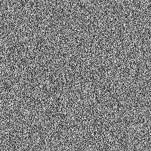
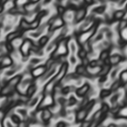

This is a collection of procedural, seeded noises. Useful for CPU based raytracers and as building blocks for procedural art and textures.

The noises are optimized for speed. All noises are available in all 4 dimensions (1D, 2D, 3D, 4D) and return a value between -1.0 and 1.0.

All noises have the same signature so that they can be passed as parameters to the supplied fractal functions.

This library has no external dependencies.

The images were generated by tests inside the [lib.rs](src/lib.rs) file. You can see examples for every noise there.

For example the Perlin noise image was generated with

```rust
fn generate_perlin_image() {
    let seed = 1;
    let mut rng = UniformRandomGen::new(seed);

    let width = 256;
    let height = 256;
    let img = ImageBuffer::from_fn(width, height, |x, y| {
        let noise_val = perlin_noise_2d(
            &mut rng,
            x as f32 / width as f32 * 10.0,
            y as f32 / height as f32 * 10.0,
            seed,
        );
        let normalized_val = ((noise_val + 1.0) / 2.0 * 255.0) as u8;
        Luma([normalized_val])
    });

    img.save("images/perlin.png").expect("Failed to save image");
}
```

This library is currently work in progress. More noises and fractal functions are in development.

## Noise functions

### Random


```rust
pub fn random_noise_1d(rng: &mut UniformRandomGen, x: f32, seed: u32) -> f32;

pub fn random_noise_2d(rng: &mut UniformRandomGen, x: f32, y: f32, seed: u32) -> f32;

pub fn random_noise_3d(rng: &mut UniformRandomGen, x: f32, y: f32, z: f32, seed: u32) -> f32;

pub fn random_noise_4d(rng: &mut UniformRandomGen, x: f32, y: f32, z: f32, t: f32, seed: u32) -> f32;
```

### Random Filtered



```rust
pub fn random_noise_filtered_1d(rng: &mut UniformRandomGen, x: f32, seed: u32) -> f32;

pub fn random_noise_filtered_2d(rng: &mut UniformRandomGen, x: f32, y: f32, seed: u32) -> f32;

pub fn random_noise_filtered_3d(rng: &mut UniformRandomGen, x: f32, y: f32, z: f32, seed: u32) -> f32;

pub fn random_noise_filtered_4d(rng: &mut UniformRandomGen, x: f32, y: f32, z: f32, t: f32, seed: u32) -> f32;
```

### Perlin


```rust
pub fn perlin_noise_1d(rng: &mut UniformRandomGen, x: f32, seed: u32) -> f32;

pub fn perlin_noise_2d(rng: &mut UniformRandomGen, x: f32, y: f32, seed: u32) -> f32;

pub fn perlin_noise_3d(rng: &mut UniformRandomGen, x: f32, y: f32, z: f32, seed: u32) -> f32;

pub fn perlin_noise_4d(rng: &mut UniformRandomGen, x: f32, y: f32, z: f32, t: f32, seed: u32) -> f32;
```

### Musgrave



```rust
pub fn musgrave_noise_1d(rng: &mut UniformRandomGen, x: f32, seed: u32) -> f32;

pub fn musgrave_noise_2d(rng: &mut UniformRandomGen, x: f32, y: f32, seed: u32) -> f32;

pub fn musgrave_noise_3d(rng: &mut UniformRandomGen, x: f32, y: f32, z: f32, seed: u32) -> f32;

pub fn musgrave_noise_4d(rng: &mut UniformRandomGen, x: f32, y: f32, z: f32, t: f32, seed: u32) -> f32;
```

## Fractal functions

### Fractal Mul


The image uses a Perlin noise.

```rust
pub fn fractal_noise_mul_1d<F: Fn(&mut UniformRandomGen, f32, u32) -> f32>(
    rng: &mut UniformRandomGen,
    x: f32,
    noise_func: F,
    octaves: i32,
    freq_falloff: f32,
    lacunarity: f32,
    offset: f32,
    seed: u32,
) -> f32

pub fn fractal_noise_mul_2d<F: Fn(&mut UniformRandomGen, f32, f32, u32) -> f32>(
    rng: &mut UniformRandomGen,
    x: f32,
    y: f32,
    noise_func: F,
    octaves: i32,
    freq_falloff: f32,
    lacunarity: f32,
    offset: f32,
    seed: u32,
) -> f32;

pub fn fractal_noise_mul_3d<F: Fn(&mut UniformRandomGen, f32, f32, f32, u32) -> f32>(
    rng: &mut UniformRandomGen,
    x: f32,
    y: f32,
    z: f32,
    noise_func: F,
    octaves: i32,
    freq_falloff: f32,
    lacunarity: f32,
    offset: f32,
    seed: u32,
) -> f32;

pub fn fractal_noise_mul_4d<F: Fn(&mut UniformRandomGen, f32, f32, f32, f32, u32) -> f32>(
    rng: &mut UniformRandomGen,
    x: f32,
    y: f32,
    z: f32,
    t: f32,
    noise_func: F,
    octaves: i32,
    freq_falloff: f32,
    lacunarity: f32,
    offset: f32,
    seed: u32,
) -> f32;
```
